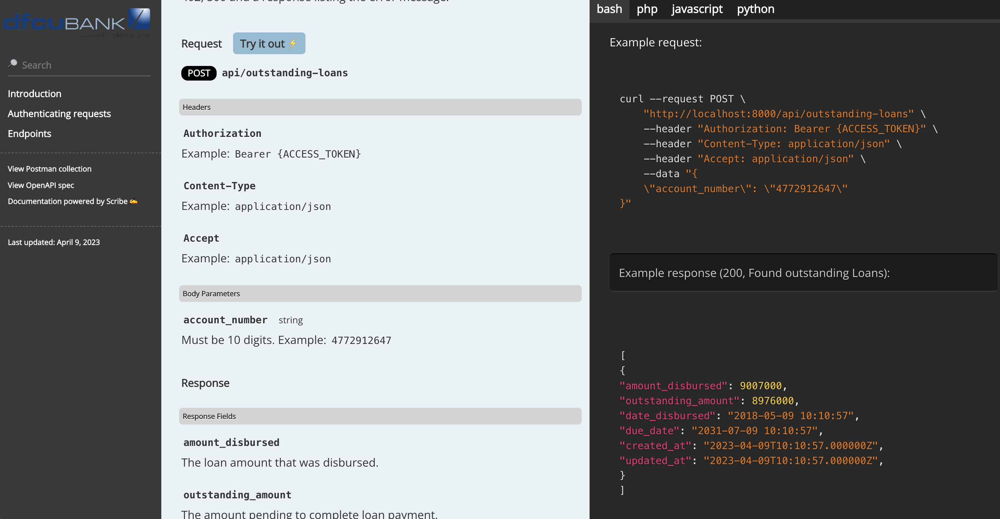

## DFCU Loans API

### This document describes how to set up and test run the outstanding loans API.
- To see and test how the API works, please visit the [docs](http://127.0.0.1:8000/docs) page after starting the application

### Tech Stack
This API is built using the following languages and tools  
- Backend: PHP >= 8.1 (Laravel Framework >= 10.2)
- Database: MySQL
- Frontend: Javascript & CSS (Tailwind CSS >= 3.1)

### Setup and running the project
Tasks and the respective commands

1. Clone the repository  
`git clone git@github.com:allandereal/dfcu-loans-api.git`
2. Move into the `dfcu-loans-api` directory  
`cd dfcu-loans-api`
3. Install composer dependencies  
`composer install`
4. Install javascript dependencies with `npm`  
`npm install`
5. Copy the `.env` file from the `.env.example file`  
`cp .env.example .env`
6. Generate the application key  
`php artisan key generate`
7. Run migrations (update the database settings in the `.env` file first by setting the database, username and password)  
`php artisan migrate`
8. Seed the database if you want to generate test data  
`php artisan db:seed`
9. Start the development server at [http://127.0.0.1:8000](http://127.0.0.1:8000)
`php artisan serve`

### Running Tests

Copy `.env.testing` file from `.env` and update database parameters to the testing database
`cp .env.example .env.testing`
Run `php artisan test`

### Interfaces
#### API performance Dashboard  [http://127.0.0.1:8000/dashboard](http://127.0.0.1:8000/dashboard)
You are required to be authenticated to view this dashboard.
You can use the following credentials generated by the `php artisan db:seed` command
email: `admin@api.dfcubank.com`, password: `password`

#### API Documentation [http://127.0.0.1:8000/docs](http://127.0.0.1:8000/docs)
To test run the API, you will need an access token that can be generated 
on the [admin dashboard](http://127.0.0.1:8000/dashboard)  

#### Simulating the API
A command that takes sample account numbers and runs them through the API.
A text file containing the API endpoint results is saved in the public folder on completion.
Please use the command `php artisan loan:simulate` to execute this.

### Screenshots
#### Admin dashboard

*Dark Theme*

*Light Theme*  

#### API Docs

### Developers
- Allan Ahumuza  
Github: [@allandereal](https://github.com/allandereal)  
Email: [ahullan@gmail.com](mailto:ahullan@gmail.com)
